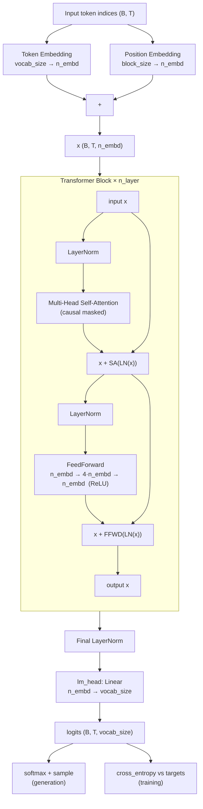
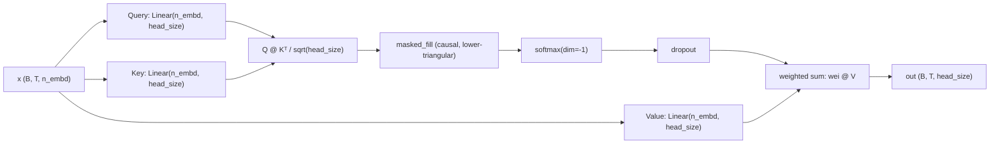

# nanogpt-1

A character-level GPT language model built completely from scratch in PyTorch, following Andrej Karpathy's ["Let's build GPT: from scratch, in code, spelled out"](https://www.youtube.com/watch?v=kCc8FmEb1nY) video. Trained on the Tiny Shakespeare dataset, it learns to generate new text, character by character, in the style of Shakespeare.

This implementation is built up from first principles — no pretrained weights, no external transformer libraries — starting from a simple bigram model and progressively adding self-attention, multi-head attention, residual connections, and layer normalization until it becomes a small but complete GPT.

## What's in this repo

| File | Description |
|---|---|
| `gpt.py` | The full model: data loading, self-attention head, multi-head attention, transformer block, the GPT model itself, and the training loop |
| `input.txt` | The training corpus — Tiny Shakespeare (~1MB of Shakespeare's works, concatenated) |
| `output.txt` | Sample text generated by the trained model |
| `requirements.txt` | Exact pinned dependency versions |
| `.gitignore` | Standard Python/venv ignores |

## Model architecture

This is a decoder-only transformer, trained autoregressively to predict the next character given all previous characters in its context window.



**Inside one attention head:**



Multiple heads (`n_head` of them, each with `head_size = n_embd / n_head`) run in parallel, and their outputs are concatenated back to `n_embd` before being projected once more inside `MultiHeadAttention`.

- **Character-level tokenization** — the vocabulary is just the unique characters that appear in `input.txt` (roughly 65 for Shakespeare), no subword tokenizer (e.g. BPE) involved.
- **Token + positional embeddings** — every character is mapped to a dense `n_embd`-dimensional vector, and a separate learned embedding encodes each position's location in the context window; the two are added together before the first transformer block.
- **Self-attention (`Head`)** — each attention head projects the input into query, key, and value vectors, computes scaled dot-product attention scores, and masks out future positions with a lower-triangular matrix so a token can only attend to itself and everything before it (causal masking) — this is what actually lets the model use context, unlike the plain bigram baseline it started from.
- **Multi-head attention (`MultiHeadAttention`)** — several attention heads run in parallel, each learning to attend to different kinds of relationships, and their outputs are concatenated and projected back to `n_embd`.
- **Feedforward network (`FeedFoward`)** — a small two-layer MLP (`n_embd → 4×n_embd → n_embd` with a ReLU in between) applied independently to every position, giving the model room to further process what attention gathered.
- **Transformer block (`Block`)** — combines multi-head attention ("communication" between tokens) and the feedforward network ("computation" per token), each wrapped in a residual connection and preceded by layer normalization (pre-norm formulation).
- **Stacked blocks + final layer norm + output head (`GPTLanguageModel`)** — `n_layer` transformer blocks stacked sequentially, followed by a final layer norm and a linear projection (`lm_head`) from `n_embd` down to vocabulary-sized logits.
- **Dropout** — applied inside attention and the feedforward network as a regularizer against overfitting.

### Default hyperparameters

| Hyperparameter | Value | Meaning |
|---|---|---|
| `batch_size` | 64 | number of sequences processed in parallel per training step |
| `block_size` | 256 | context length (max characters of history the model can see) |
| `n_embd` | 384 | embedding / model dimension |
| `n_head` | 6 | number of attention heads per block (head size = 384 / 6 = 64) |
| `n_layer` | 6 | number of stacked transformer blocks |
| `dropout` | 0.2 | dropout probability |
| `max_iters` | 5000 | total training steps |
| `eval_interval` | 500 | how often train/val loss is evaluated and printed |
| `eval_iters` | 200 | number of batches averaged over for each loss evaluation |
| `learning_rate` | 3e-4 | AdamW learning rate |

This configuration has roughly 10M parameters — small enough to train from scratch on a single consumer GPU, unlike the full 124M-parameter GPT-2 reproduction.

## Setup

**Requirements:** Python 3.10+ and a CUDA-capable GPU are recommended (the model will fall back to CPU automatically, but training will be dramatically slower — expect this configuration to be impractical on CPU).

```bash
git clone https://github.com/Atharv-2032/nanogpt-1.git
cd nanogpt-1

python3 -m venv venv
source venv/bin/activate        # on Windows: venv\Scripts\activate

pip install -r requirements.txt
```

> **Note:** `requirements.txt` pins specific CUDA-related package versions (`nvidia-cublas`, `nvidia-cudnn-cu13`, etc.) alongside `torch`. If you're on a different CUDA version or on CPU-only hardware, you may prefer to install PyTorch directly from [pytorch.org/get-started](https://pytorch.org/get-started/locally/) for your specific setup instead of using the pinned GPU wheels here.

## Usage

### Train the model

```bash
python gpt.py
```

This will:
1. Load and tokenize `input.txt`.
2. Split it 90/10 into train/validation sets.
3. Train for `max_iters` steps, printing train and validation loss every `eval_interval` steps.
4. Generate 500 characters of sample text and print it to the console.
5. Generate 10,000 characters of sample text and write it to `more.txt`.

Training this configuration (10M parameters, 5000 steps) takes roughly 15–20 minutes on a single consumer GPU (e.g. an RTX 4050/3060-class card); on CPU this would take on the order of many hours and is not recommended.

### Check whether it's actually training on GPU

```python
import torch
print(torch.cuda.is_available())      # should print True
print(torch.cuda.get_device_name(0))  # should print your GPU's name
```

You can also monitor `nvidia-smi` in a separate terminal while `gpt.py` is running — you should see a Python process consuming GPU memory and utilization.

### Generate more text from a trained model

The `generate` method on `GPTLanguageModel` can be called with any starting context (by default, generation starts from a single blank/zero token) and will autoregressively sample one character at a time, always conditioning on up to the last `block_size` characters:

```python
context = torch.zeros((1, 1), dtype=torch.long, device=device)
print(decode(m.generate(context, max_new_tokens=500)[0].tolist()))
```

## How training works, briefly

- Random mini-batches of `block_size`-length character sequences are sampled from the training split (`get_batch`).
- Each batch is fed through the model; for every position in the sequence, the model predicts a probability distribution over the next character.
- Loss is computed with cross-entropy against the actual next character at every position simultaneously.
- Gradients are computed via backpropagation and the AdamW optimizer updates all model parameters.
- Every `eval_interval` steps, train and validation loss are estimated (in `torch.no_grad()` mode, with the model temporarily switched to `.eval()`) to track overfitting.

## Relationship to the "Let's build GPT" video

This repository follows the video's progression: it starts as a plain bigram model (predicting the next character using only the current one, with no attention at all), then incrementally adds:
1. A toy "average of all previous tokens" mechanism, to establish the idea of mixing information across time.
2. Single-head self-attention, replacing that fixed averaging with learned, content-dependent weights.
3. Multi-head attention.
4. Feedforward layers, residual connections, and layer normalization, assembled into a full transformer block.
5. Stacking multiple blocks into the final `GPTLanguageModel`.

The weight initialization scheme (`_init_weights`, normal with `std=0.02`) mirrors GPT-2's own initialization, a detail the video calls out as not covered in the original walkthrough but worth including.
